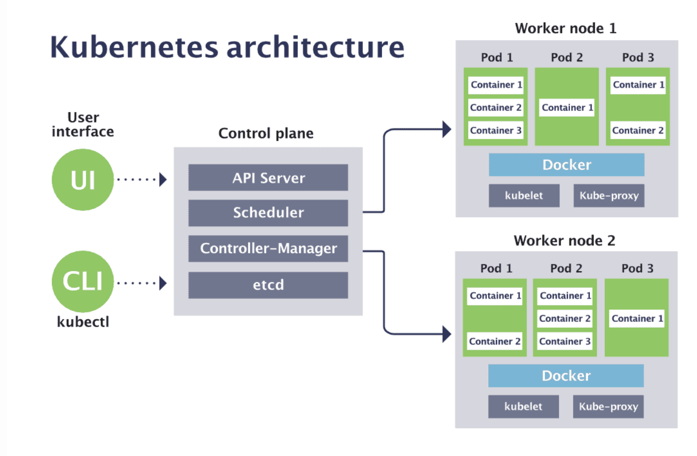

# Deployment evolution
# What & Why K8s
# K8s Architecture
# K8s request flow

# Deployment Evolution in Modern Software Engineering?

[Deployment evolution](https://kubernetes.io/docs/concepts/overview/#why-you-need-kubernetes-and-what-can-it-do)

# What and Why K8s?

[k8s-overview](https://www.opsramp.com/guides/why-kubernetes/kubernetes-architecture/)

Containers are an excellent way to bundle and run applications, but they lack mechanisms for high availability (HA), scalability, and auto-healing. This is where Kubernetes (K8s) comes into play. It provides a robust framework that efficiently manages failover, HA, and scalability.

Deployable means "ready to be launched or executed in a system."

Kubernetes (K8s) is a powerful platform for managing containerized applications at scale. It provides essential features for ensuring high availability, scalability, and resilience, which are crucial for modern, dynamic applications. Here’s a breakdown of the features you mentioned:

1. **Service Discovery & Load Balancing**:
   Kubernetes can automatically expose a container to the outside world using DNS names or IP addresses. It can also load-balance network traffic across multiple containers to ensure that traffic is distributed evenly, ensuring optimal application performance.

2. **Storage Orchestration**:
   Kubernetes allows you to automatically mount storage systems like local storage, public cloud providers, or network storage to containers. This makes it easy to manage persistent storage requirements for stateful applications.

3. **Automated Rollouts & Rollbacks**:
   Kubernetes can automatically update applications by rolling out new versions of containers without downtime. If there is an issue, it can easily roll back to a previous stable version, ensuring continuous availability.

4. **Automatic Bin Packing**:
   Kubernetes optimally schedules containers on nodes based on resource requests and limits. It automatically packs containers in a way that maximizes the resource usage of your cluster while respecting constraints like CPU and memory.

5. **Self Healing**:
   Kubernetes continuously monitors the health of applications. If a container or node fails, Kubernetes will automatically reschedule and restart containers to ensure that the desired state is maintained.

6. **Secret and Configuration Management**:
   Kubernetes provides a secure way to store and manage sensitive information such as passwords, API keys, and configuration data. This ensures that sensitive data is protected and can be easily injected into containers.

7. **Dual Stack Support**:
   Kubernetes supports both IPv4 and IPv6, enabling a smoother transition to IPv6 networks while maintaining compatibility with existing IPv4 networks.

8. **Designed for Extensibility**:
   Kubernetes is highly extensible. It supports custom resources and controllers, allowing developers to extend its functionality and integrate it with other systems or applications.

9. **Horizontal Pod Autoscaling (HPA)**:
   Kubernetes can automatically scale the number of pods in a deployment based on resource usage (such as CPU or memory), ensuring that the application can handle varying loads.

# K8s Architecture?

K8s by default Cluster In nature, cluster is nothing but a group of nodes,some nodes acts as a `\control plane` some `worker nodes`

`control plane` is responsible to manage containers like placement,keep the configuration,ensure HA, Scalability and healing of the containers.

Where as `worker nodes` responsible to host the workloads[applications] are running here

*Master Node Components*

The `apiserver` is the single entry point for requests, handling authentication (verifying identity), authorization (checking permissions), and validation before storing request configurations in etcd.

The `Scheduler` is responsible for pod placement. It receives requests from the `apiserver`, retrieves node statistics, and runs filtering and scoring algorithms to find the best-fit node. The response is sent back to the `apiserver`, which then updates the scheduling configuration in etcd.

`etcd` is a high-availability key-value data store that holds the entire cluster configuration.

The `Controller Manager` is responsible for maintaining the cluster's desired state by monitoring and adjusting resources. It includes controllers like `ReplicaSet`, `Deployment`, `EndpointController`, `Node`, and `Job` controllers, which ensure that pods, deployments, endpoints, and other resources align with the cluster's specifications.

In EKS, the `Cloud Controller Manager` manages integration with AWS cloud services. It handles tasks like provisioning AWS resources (e.g., load balancers, EBS volumes), managing node lifecycles, and updating routes. This allows Kubernetes to leverage AWS infrastructure efficiently within an EKS cluster.

*Worker Node Components*

 `kubelet` An agent running on each node that takes instructions from the `apiserver` to create and manage pods, while also updating pod status back to the `apiserver`.

- `kube-proxy` is a **networking component** that runs on each **node** in a Kubernetes cluster,It ensures that **network traffic** is properly routed between **Pods** and **Services and It manages **IPtables**, **IPVS**, or other networking backend rules to enable communication. [It **routes traffic** from **Services** to the appropriate **Pods**]

- `CRI` (Container Runtime Interface) Responsible for creating and managing containers, supporting container operations as directed by Kubernetes.

**Flow of `kubectl apply -f pod.yaml`:**

1. The `API server` receives the request.
2. It writes the configuration to `etcd`.
3. The `API server` passes the pod configuration to the `Scheduler` for pod placement.
4. The `Scheduler` requests node information from the `API server`.
5. The `API server` fetches node information from `etcd`.
6. The `API server` hands over the node information to the `Scheduler`.
7. The `Scheduler` runs an algorithm for pod placement, considering any constraints the pod may have.
8. The `Scheduler` returns the pod placement information to the `API server`.
9. The `API server` updates the pod placement information in `etcd`.
10. The `API server` calls the `kubelet` on the respective node and passes the pod information.
11. The `kubelet` instructs the container runtime to create the container.
12. Once the container is created, the `kubelet` wraps it as a pod.
13. The `kubelet` sends the pod creation status back to the `API server`.
14. The `API server` updates the pod status in `etcd`.
15. The `API server` responds to the client with the pod creation status.

In **Kubernetes**, container states inside a Pod:  
✅ **Pending** → Waiting to start  
✅ **Running** → Application is active  
✅ **Succeeded** → Completed successfully  
✅ **Failed** → Crashed or exited with an error  
✅ **Unknown** → Status can't be determined 

