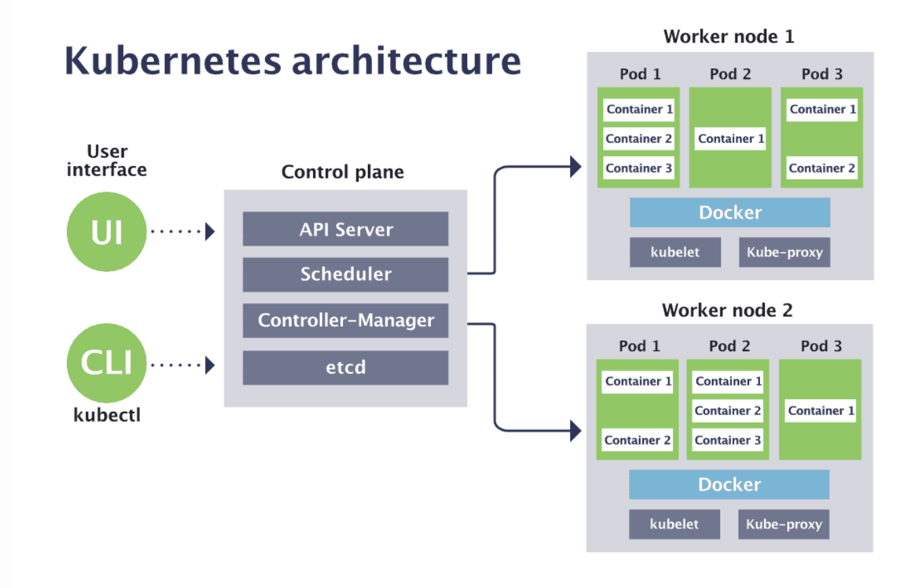

# Deployment Evolution in Modern Software Engineering?

# What and Why K8s?

# K8s Architecture?

K8s by default Cluster In nature, cluster is nothing but a group of nodes,some nodes acts as a `\control plane` some `worker nodes`

`control plane` is responsible to manage containers like placement,keep the configuration,ensure HA, Scalability and healing of the containers.

Where as `worker nodes` responsible to host the workloads[applications] are running here

*Master Node Components*

The `apiserver` is the single entry point for requests, handling authentication (verifying identity), authorization (checking permissions), and validation before storing request configurations in etcd.

The `Scheduler` is responsible for pod placement. It receives requests from the `apiserver`, retrieves node statistics, and runs filtering and scoring algorithms to find the best-fit node. The response is sent back to the `apiserver`, which then updates the scheduling configuration in etcd.

`etcd` is a high-availability key-value data store that holds the entire cluster configuration.

The `Controller Manager` is responsible for maintaining the cluster's desired state by monitoring and adjusting resources. It includes controllers like `ReplicaSet`, `Deployment`, `EndpointController`, `Node`, and `Job` controllers, which ensure that pods, deployments, endpoints, and other resources align with the cluster's specifications.

In EKS, the `Cloud Controller Manager` manages integration with AWS cloud services. It handles tasks like provisioning AWS resources (e.g., load balancers, EBS volumes), managing node lifecycles, and updating routes. This allows Kubernetes to leverage AWS infrastructure efficiently within an EKS cluster.

*Worker Node Components*

 `kubelet` An agent running on each node that takes instructions from the `apiserver` to create and manage pods, while also updating pod status back to the `apiserver`.

- `kube-proxy` is a **networking component** that runs on each **node** in a Kubernetes cluster,It ensures that **network traffic** is properly routed between **Pods** and **Services and It manages **IPtables**, **IPVS**, or other networking backend rules to enable communication. [It **routes traffic** from **Services** to the appropriate **Pods**]

- `CRI` (Container Runtime Interface) Responsible for creating and managing containers, supporting container operations as directed by Kubernetes.

**Flow of `kubectl apply -f pod.yaml`:**

1. The `API server` receives the request.
2. It writes the configuration to `etcd`.
3. The `API server` passes the pod configuration to the `Scheduler` for pod placement.
4. The `Scheduler` requests node information from the `API server`.
5. The `API server` fetches node information from `etcd`.
6. The `API server` hands over the node information to the `Scheduler`.
7. The `Scheduler` runs an algorithm for pod placement, considering any constraints the pod may have.
8. The `Scheduler` returns the pod placement information to the `API server`.
9. The `API server` updates the pod placement information in `etcd`.
10. The `API server` calls the `kubelet` on the respective node and passes the pod information.
11. The `kubelet` instructs the container runtime to create the container.
12. Once the container is created, the `kubelet` wraps it as a pod.
13. The `kubelet` sends the pod creation status back to the `API server`.
14. The `API server` updates the pod status in `etcd`.
15. The `API server` responds to the client with the pod creation status.

